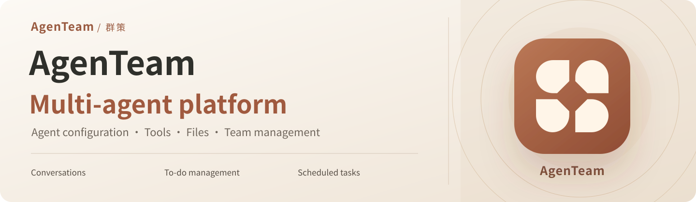
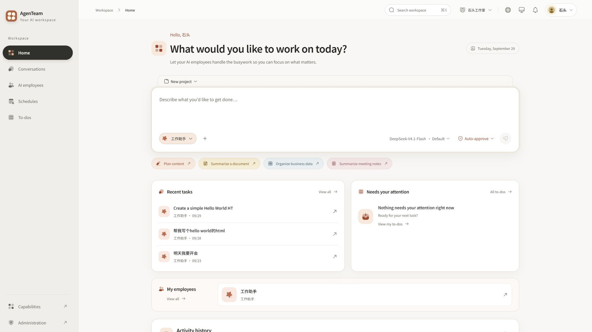
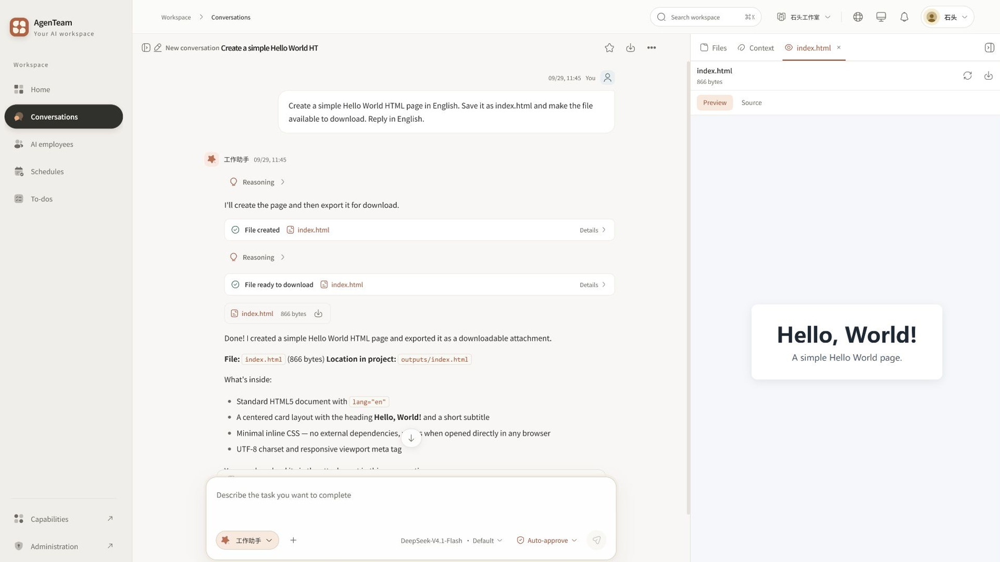
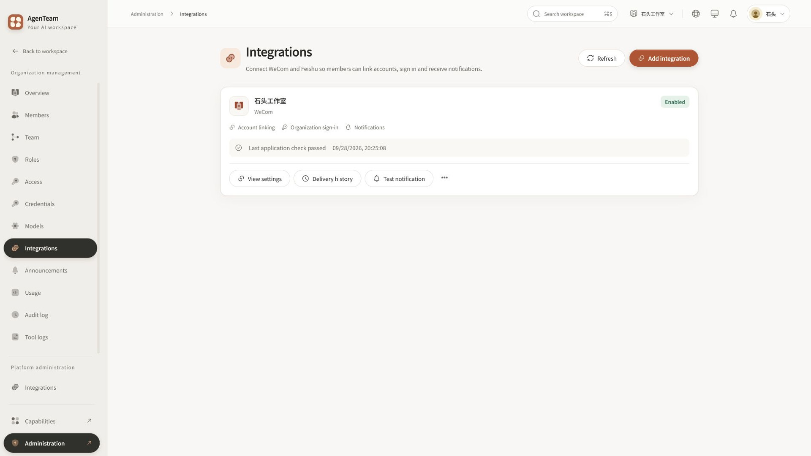
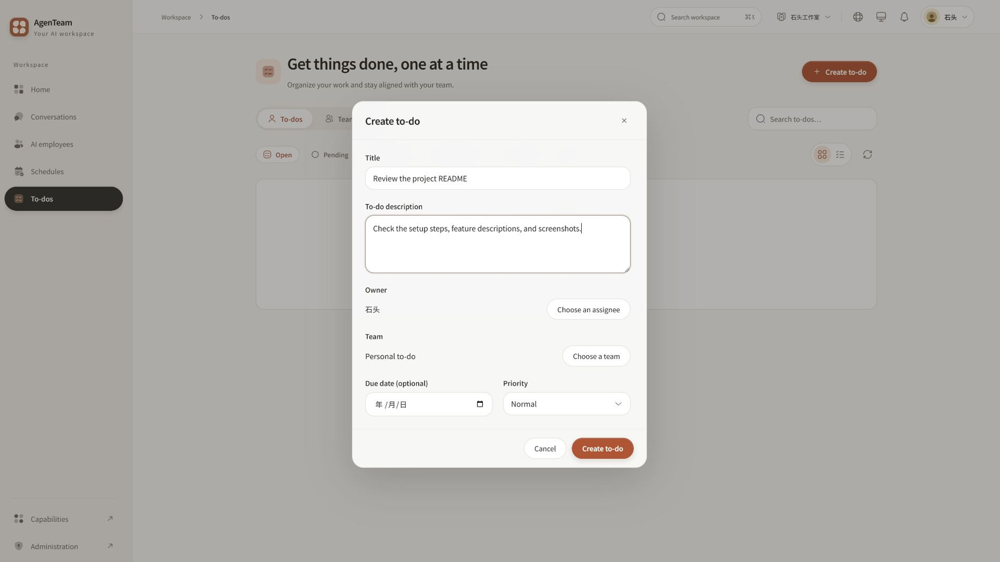
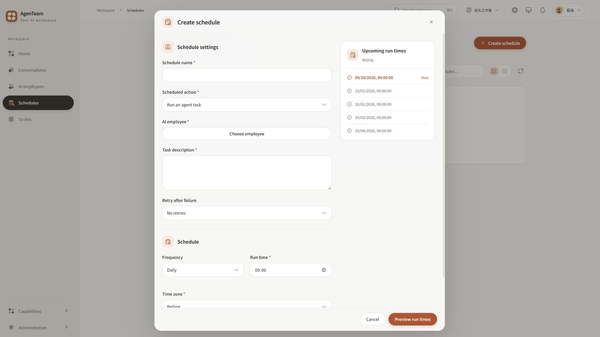
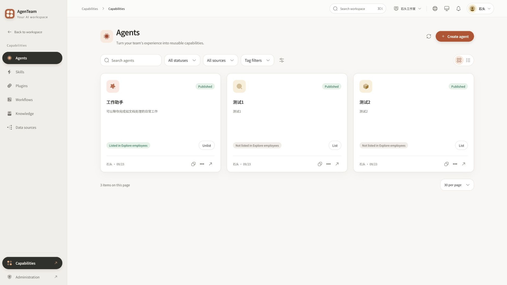

<p align="center">
  
</p>

<p align="center">
  <a href="README.md">简体中文</a> · <strong>English</strong>
</p>

<p align="center">
  <a href="agenteam-web/package.json"></a>
  <a href="agenteam-server/pom.xml"></a>
  <a href="agenteam-server/pom.xml"></a>
  <a href="agenteam-web/package.json"></a>
  <a href="#quick-start"></a>
</p>

<p align="center">
  <a href="#workspace">Workspace</a> ·
  <a href="#conversations">Conversations</a> ·
  <a href="#enterprise-messaging">WeCom &amp; Feishu</a> ·
  <a href="#todos">To-dos</a> ·
  <a href="#schedules">Schedules</a> ·
  <a href="#quick-start"><strong>Quick start</strong></a>
</p>

AgenTeam is a self-hosted multi-agent platform with conversations, tool execution, file processing, WeCom and Feishu integrations, to-dos, and scheduled tasks. The repository includes a web frontend, a Java backend, and container deployment configuration.

Agents have configurable models, skills, knowledge bases, and tools. Organization members use published agents as AI (artificial intelligence) employees, while administrators manage model services, member roles, and resource access.

## Workspace

Create projects, select agents, start tasks, and resume existing conversations.

<a href="media/readme/screenshots/en/workspace.jpg"></a>

## Conversations

Multi-turn conversations support tool calls, subagent delegation, and manual approval. Generated files can be previewed, downloaded, and reused across conversations in the same project.

<a href="media/readme/screenshots/en/conversation.jpg"></a>

<a id="enterprise-messaging"></a>

## WeCom and Feishu

Connect enterprise custom apps on WeCom and Feishu for account linking, platform sign-in, and notifications.

- **Account linking and sign-in:** Members can link an existing AgenTeam account to their WeCom or Feishu account and enable sign-in with that account.
- **Event notifications:** Members can choose which notifications to receive through their linked accounts, including task completion, approval requests, and to-do assignments.
- **Scheduled notifications:** Send personal notifications to selected members at scheduled times through in-app, WeCom, and Feishu channels. Delivery results are available for each recipient and channel.
- **App configuration:** Administrators manage credentials, validate apps, send test notifications, and control account linking, sign-in, and notification delivery separately.

See the [enterprise messaging guide (Chinese)](docs/deployment/enterprise-messaging.md) for application setup, platform authorization, and member account linking.

<a href="media/readme/screenshots/en/integrations.jpg"></a>

<a id="todos"></a>

## To-dos

Manage personal and team tasks with owners, due dates, priorities, and status updates.

<a href="media/readme/screenshots/en/todos.jpg"></a>

## Schedules

Run agent tasks or send notifications on one-time, daily, weekly, or monthly schedules. Preview upcoming runs, pause schedules, and review execution history.

<a href="media/readme/screenshots/en/schedules.jpg"></a>

<a id="capabilities-and-management"></a>

This repository contains the 0.2.0 Community Edition source; this split release has not been published yet. It supports the single organization created during initialization, with no commercial member limit. WeCom, Feishu, notifications, and scheduled tasks are shared features. See the [edition and API notes](docs/editions/community.md).

## Capabilities and administration

<table>
  <tr>
    <td width="50%" valign="top">
      <h3>Capabilities</h3>
      <a href="media/readme/screenshots/en/agents.jpg"></a>
      <p>Configure agents, skills, plugins, knowledge bases, and data sources. Publish agent versions and make them available to authorized members.</p>
    </td>
    <td width="50%" valign="top">
      <h3>Administration</h3>
      <p>Manage the initial organization, members and teams, assign built-in roles, configure access for the organization or individual members, and view basic execution usage. Model services and connection credentials are included.</p>
    </td>
  </tr>
</table>

The platform supports OpenAI-compatible model services, built-in plugins, and MCP (Model Context Protocol, a standard for connecting external tools) services.

---

## Quick start

Deploy with Docker (a container runtime) and Docker Compose (a tool for running multiple containers). The deployment includes the application, database, cache, and office sandbox—a separate container for running commands and processing files.

Install Git, Docker, and Docker Compose. On Windows, use Docker Desktop in Linux container mode. The first build downloads dependencies, so your machine needs access to container registries and Maven, npm, and Python package repositories.

### 1. Get the project

```sh
git clone https://github.com/Stonewuu/agenteam.git
cd agenteam/deploy
```

### 2. Generate the configuration

Linux / macOS:

```sh
sh configure.sh single
```

Windows PowerShell:

```powershell
.\configure.ps1 -Mode single
```

The script creates `.env` with randomly generated database passwords, service credentials, and an initial setup credential. It preserves any existing configuration file.

### 3. Start the services

Run these commands in the `deploy` directory:

```sh
docker compose config --quiet
docker compose up -d --build --wait --wait-timeout 300
```

Once the services are ready, open **[http://localhost:8088](http://localhost:8088)** and complete the following steps:

1. **Set up your account:** Follow the setup screen. Use the `SETUP_CREDENTIAL` value from `deploy/.env` as your initial setup credential.
2. **Connect a model:** Go to **Organization management → Models** and add a provider, access key, and model.
3. **Use an agent:** Create an agent under **Capabilities**, then publish and list it. Hire it under **AI employees** and start a conversation. Enable command execution for the agent if it needs to work with office files.

<details>
<summary><strong>Server deployment and common settings</strong></summary>

The default configuration listens on localhost. To make the service accessible from other machines, set the public address and listening address in `.env`, and serve it over HTTPS (encrypted web connections). See the [configuration example](deploy/.env.example) for all variables and the [Nginx reverse proxy example](examples/deployment/nginx.production.example.conf) for the web entry point.

| Setting                                                                 | Purpose                                                                                                                           |
| ----------------------------------------------------------------------- | --------------------------------------------------------------------------------------------------------------------------------- |
| `PUBLIC_URL`                                                            | The address users visit, also used for application links, email links, and enterprise account authorization callbacks.            |
| `BIND_ADDRESS`, `HTTP_PORT`                                             | The listening address and port. Defaults to `127.0.0.1:8088`.                                                                     |
| `SPRING_PROFILES_ACTIVE`                                                | The active application profiles. Use `container,production` for production and supply the required connection and email settings. |
| `MAIL_HOST`, `MAIL_PORT`, `MAIL_USERNAME`, `MAIL_PASSWORD`, `MAIL_FROM` | Email delivery settings for email verification, password recovery, and invitations.                                               |
| `ALLOWED_PRIVATE_ORIGINS`                                               | Internal service addresses the application needs to reach, such as a local model service at `http://host.docker.internal:11434`.  |
| `SANDBOX_MEMORY_MB`, `SANDBOX_MAXIMUM_CONCURRENT`                       | The memory limit for command containers and the maximum number of concurrent tasks.                                               |

For WeCom and Feishu application setup, account linking, and notifications, see the [enterprise messaging guide (Chinese)](docs/deployment/enterprise-messaging.md).

Before upgrading, back up the database, configuration, application keys, and project files, and retain the existing data volumes. If an existing database was created before the initialization migrations were consolidated, read the [database migration guide (Chinese)](scripts/database-migration/README.md) first. Use `docker compose stop` for routine shutdowns. Do not use `docker compose down -v` when you need to retain your data.

</details>

## Local development

Run the frontend and backend separately, with the database and cache in containers. Install Java 21, Node.js 24, pnpm 11.15.1 (the frontend package manager), and Docker. The backend includes the Maven Wrapper, so a separate Maven installation is unnecessary.

<details>
<summary><strong>Local setup instructions</strong></summary>

**Prepare the database and office environment**

Generate `deploy/.env` as described in [Quick start](#quick-start), then run the following commands in `deploy`:

```sh
docker compose -f compose.yaml -f compose.dev.yaml up -d mysql redis
docker build -t agenteam/sandbox-office:local sandbox
```

**Start the backend**

Open `agenteam-server` and set these environment variables in your terminal:

| Environment variable      | Value                               |
| ------------------------- | ----------------------------------- |
| `AGENTEAM_DB_USERNAME`    | `agenteam`                          |
| `AGENTEAM_DB_PASSWORD`    | `DB_PASSWORD` from `deploy/.env`    |
| `AGENTEAM_REDIS_PASSWORD` | `REDIS_PASSWORD` from `deploy/.env` |

The default configuration connects to MySQL on local port `43306` and Redis on local port `46379`.

```sh
./mvnw spring-boot:run
```

In Windows PowerShell, use `.\mvnw.cmd spring-boot:run`. The backend listens on port `8080` by default and stores runtime data in `.agenteam/` inside the backend directory.

**Start the frontend**

In another terminal, open `agenteam-web`:

```sh
corepack enable
pnpm install --frozen-lockfile
pnpm dev
```

Open **[http://localhost:3000](http://localhost:3000)**. The frontend connects to `http://localhost:8080` by default. Set `AGENT_BACKEND_URL` to use a different backend address.

</details>

<details>
<summary><strong>Tests and production builds</strong></summary>

For the backend, run these commands in `agenteam-server`:

```sh
./mvnw test
./mvnw package -DskipTests
```

In Windows PowerShell, replace `./mvnw` with `.\mvnw.cmd`. Backend tests require Docker and use separate MySQL and Redis containers. Office document tests use the `agenteam/sandbox-office:local` image built in the setup steps above.

For the frontend, run these commands in `agenteam-web`:

```sh
pnpm lint
pnpm exec tsc --noEmit
pnpm build
```

Run the additional tests relevant to your changes. Available commands are listed in [package.json](agenteam-web/package.json).

</details>

## Technology and repository layout

| Area                           | Main technologies                                                                                                                                                               |
| ------------------------------ | ------------------------------------------------------------------------------------------------------------------------------------------------------------------------------- |
| Web interface                  | Next.js 16 for the web application, React 19 for interface components, TypeScript for typed JavaScript, and Tailwind CSS for styling.                                           |
| Backend                        | Java 21, Spring Boot 4 for the application framework, and AgentScope 2 for agent execution.                                                                                     |
| Data storage                   | MySQL for business data and Redis for login sessions and live conversation data. MyBatis-Plus and MyBatis-Plus-Join handle database access; Flyway manages database migrations. |
| Deployment and file processing | Docker Compose runs the services, Nginx provides the web entry point, and the office sandbox runs commands and processes documents.                                             |

```text
agenteam/
├── agenteam-web/       # Web interface and frontend features
├── agenteam-server/    # Backend services and tool extension interfaces
├── deploy/            # Container deployment and office sandbox images
├── docs/              # Deployment and usage guides
├── examples/          # Proxy, monitoring, and database configuration examples
├── scripts/           # Local development and database maintenance tools
└── tests/             # Deployment checks
```

## Contributing

Community source is available under [Apache-2.0](LICENSE). See the [contribution guide](CONTRIBUTING.md) for contribution and third-party attribution requirements.

Copyright (c) 2026 stonewu. See [NOTICE](NOTICE). Third-party components retain their respective copyright notices and licenses.

Share suggestions, report problems through [Issues](https://github.com/Stonewuu/agenteam/issues), or open a pull request to improve the code and documentation.

- **Report a problem:** Include steps to reproduce it, the expected result, and what actually happened. Screenshots help with interface issues.
- **Suggest an improvement:** Describe the work you want to accomplish and what gets in your way. Discuss the scope of larger changes before starting.
- **Submit a change:** Keep it focused on one problem. Explain the reason for the change, how you verified it, and any deployment or database changes it requires.

Keep access keys, account credentials, and real business data out of reports, screenshots, and code. Preserve copyright and license notices when using third-party code.
