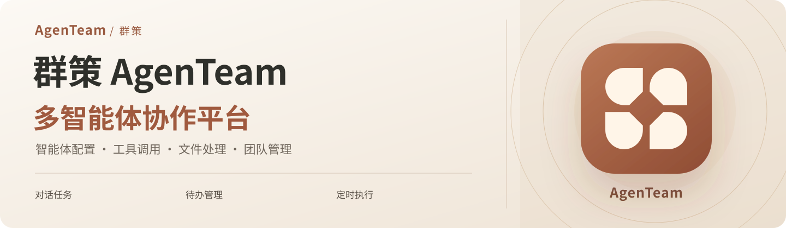
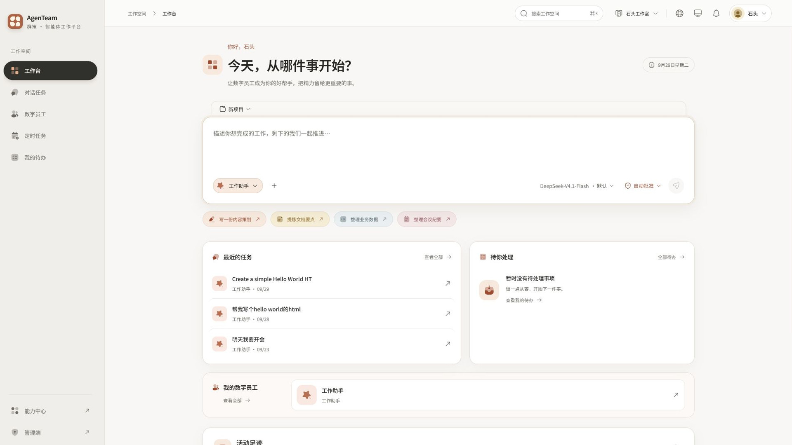
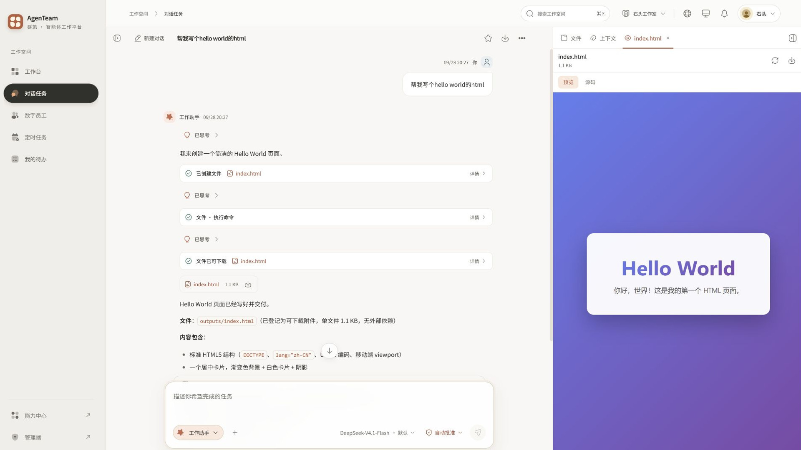
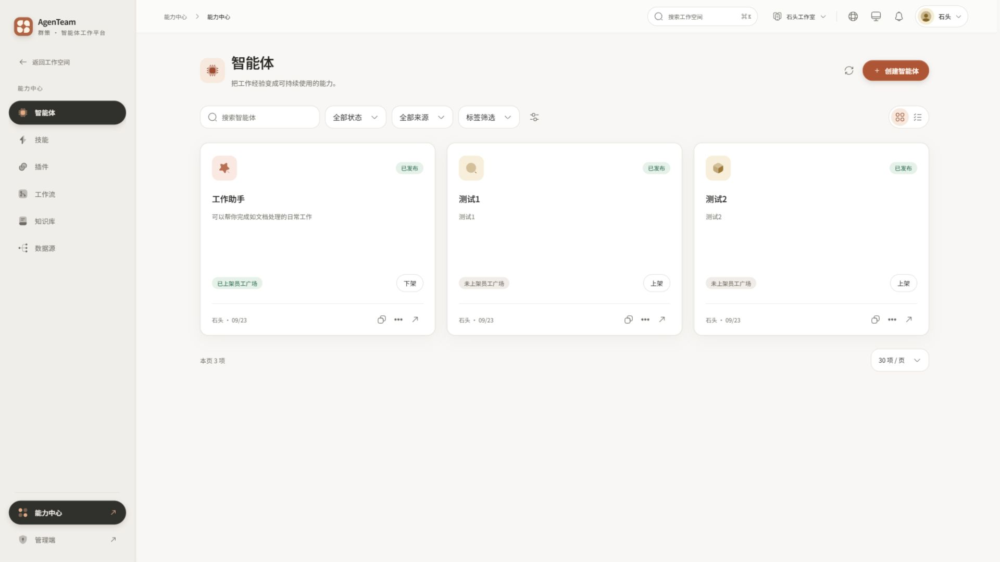
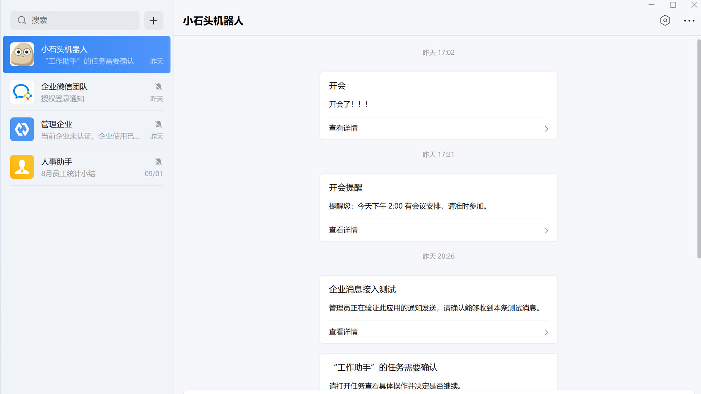
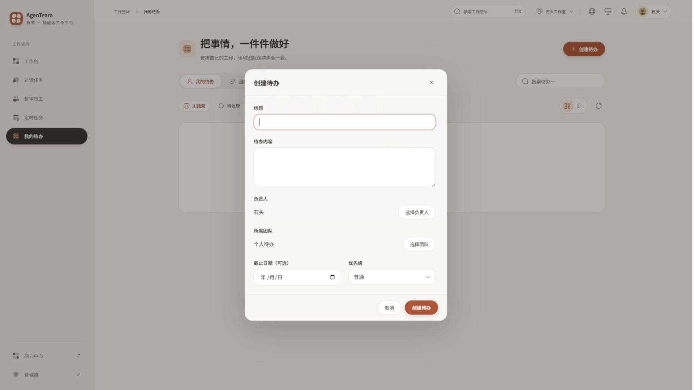
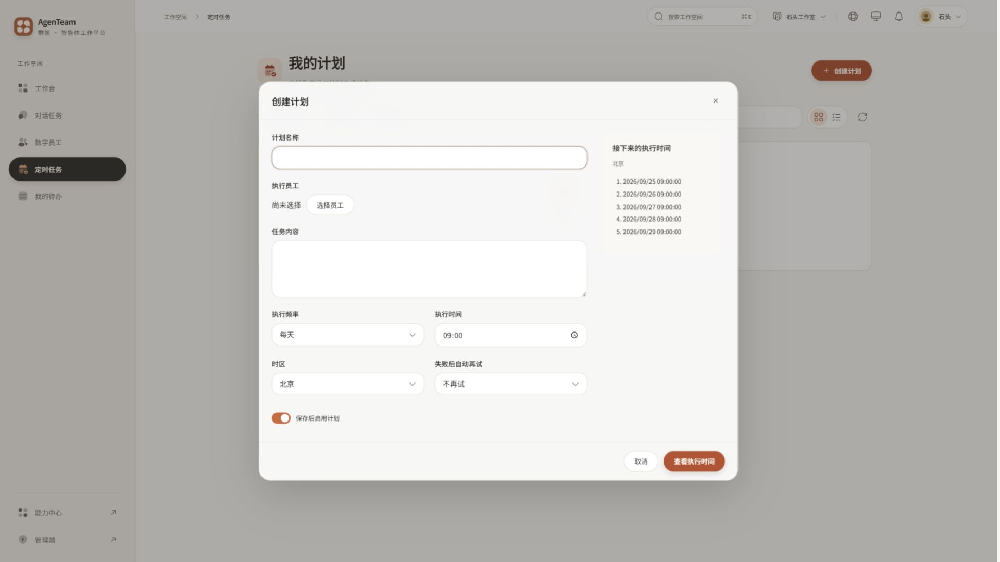

<p align="center">
  
</p>

<p align="center">
  <strong>简体中文</strong> · <a href="README.en.md">English</a>
</p>

<p align="center">
  <a href="https://github.com/Stonewuu/agenteam/releases/tag/v0.2.0"></a>
  <a href="LICENSE"></a>
  <a href="docs/deployment/images.md"></a>
</p>

<p align="center">
  <a href="#workspace">工作台</a> ·
  <a href="#conversations">数字员工与对话</a> ·
  <a href="#enterprise-messaging">企业微信与飞书</a> ·
  <a href="#schedules">待办与定时任务</a> ·
  <a href="#quick-start"><strong>快速开始</strong></a>
</p>

**AgenTeam（群策）是一个开源、可自主部署的多智能体协作平台，让数字员工参与团队的日常工作。**

把模型、知识、技能和工具组合成数字员工，在同一工作台中完成对话任务、处理文件、协作跟进待办，并通过企业微信和飞书连接团队。你可以按项目组织工作，持续复用任务上下文与生成的成果。

| 你想完成的工作 | AgenTeam 提供的能力 |
| --- | --- |
| 为不同岗位配置数字员工 | 组合模型、技能、知识库和工具，发布智能体并供成员雇佣使用。 |
| 在对话中完成实际任务 | 多轮交流、工具调用、子智能体协作，以及关键步骤的人工确认。 |
| 整理和交付工作成果 | 处理办公文件，预览、下载生成结果，在项目中继续使用。 |
| 让团队及时跟进 | 个人与团队待办、负责人、截止日期、优先级和业务通知。 |
| 安排周期性工作 | 一次性、每日、每周和每月计划，自动执行任务或发送通知。 |
| 接入现有协作工具 | 企业微信与飞书账号绑定、平台登录和个人通知。 |

<a id="workspace"></a>

## 从项目开始，组织好每一项工作

在工作台创建项目、选择数字员工并发起任务。历史对话、项目文件和待办集中在一起，方便随时继续工作。

<a href="media/readme/screenshots/workspace.jpg"></a>

<a id="conversations"></a>

## 与数字员工一起完成任务

通过自然语言说明目标，让数字员工结合知识与工具开展工作。对话支持多轮交流、子智能体协作和人工确认；生成的文件可以直接预览、下载，并在同一项目的后续任务中复用。

<a href="media/readme/screenshots/conversation.jpg"></a>

## 把知识和工具变成可复用的能力

在能力中心维护智能体、技能、插件、知识库和数据源，通过版本发布、智能体上架和资源授权供团队使用。支持兼容 OpenAI 接口的模型服务，以及 MCP（模型上下文协议，用于连接外部工具服务）工具。

管理员可以维护企业资料、成员与团队，分配角色和资源访问权限，配置模型服务，并查看执行用量。

<a href="media/readme/screenshots/agents.jpg"></a>

<a id="enterprise-messaging"></a>

## 连接企业微信与飞书

把 AgenTeam 接入团队正在使用的协作工具，让账号和工作通知连在一起。

- **账号与登录**：绑定已有 AgenTeam 账号，使用企业微信或飞书身份登录。
- **业务通知**：接收任务完成、待确认、待办分配等消息。
- **定时通知**：按计划向指定成员发送通知，查看逐人、逐渠道的发送结果。
- **应用管理**：在管理页面维护企业自建应用，完成凭据配置、应用校验和通知测试。

[查看企业消息配置指南 →](docs/deployment/enterprise-messaging.md)

<a href="media/readme/screenshots/wecom-notifications.jpg"></a>

<a id="schedules"></a>

## 让待办有人跟进，让计划按时执行

用待办记录事项、安排负责人、设置截止日期和优先级；用定时任务安排智能体工作或团队通知。执行时间可以预览，计划可以暂停，历史结果可以随时查询。

<table>
  <tr>
    <td width="50%"><a href="media/readme/screenshots/todos.jpg"></a></td>
    <td width="50%"><a href="media/readme/screenshots/schedules.jpg"></a></td>
  </tr>
</table>

<a id="quick-start"></a>

## 快速开始

**服务器安装推荐使用 Docker Hub 上的 0.2.0 镜像。** 部署包提供配套的服务配置和初始化工具，完整步骤见 [Docker 镜像部署指南](docs/deployment/images.md)。

也可以直接从源码启动。准备 Git、Docker（容器运行工具）和 Docker Compose（多容器启动工具）；Windows 使用 Docker Desktop 的 Linux 容器模式。

### 1. 获取项目

```sh
git clone https://github.com/Stonewuu/agenteam.git
cd agenteam/deploy
```

### 2. 生成配置

Linux / macOS：

```sh
sh configure.sh single
```

Windows PowerShell：

```powershell
.\configure.ps1 -Mode single
```

配置工具会创建 `.env`，生成数据库密码、服务凭据和首次初始化凭据，并保留已有配置。

### 3. 启动并开始使用

```sh
docker compose config --quiet
docker compose up -d --build --wait --wait-timeout 300
```

打开 **[http://localhost:8088](http://localhost:8088)**，完成三步设置：

1. **创建工作空间**：使用 `deploy/.env` 中的 `SETUP_CREDENTIAL`（首次初始化凭据）创建管理员和企业。
2. **连接模型**：在“企业管理 → 模型配置”添加模型服务、访问密钥和模型。
3. **开始一项任务**：在“能力中心”创建、发布并上架智能体，到“数字员工”中雇佣后发起对话。处理办公文件时，为智能体启用命令执行能力。

对外提供访问时，为实际域名配置 HTTPS（加密网页连接），并设置 `PUBLIC_URL`（站点访问地址）。接入邮件服务后即可使用邮箱验证、找回密码和邮件邀请。部署参数见 [配置示例](deploy/.env.example)，入口配置见 [Nginx 反向代理示例](examples/deployment/nginx.production.example.conf)。

## 开发与贡献

AgenTeam 使用 Java 21、Spring Boot 4（后端应用框架）、AgentScope 2（智能体开发框架）、Next.js 16（网页应用框架）和 React 19（界面组件库）。MySQL 保存业务数据，Redis 保存会话与对话实时数据。

<details>
<summary><strong>本地开发步骤</strong></summary>

准备 Java 21、Node.js 24、pnpm 11.15.1（前端包管理器）和 Docker，按前面的步骤生成 `deploy/.env`。

在 `deploy` 目录启动依赖服务：

```sh
docker compose -f compose.yaml -f compose.dev.yaml up -d mysql redis
docker build -t agenteam/sandbox-office:local sandbox
```

进入 `agenteam-server`，在当前终端设置 `AGENTEAM_DB_USERNAME=agenteam`，并把 `.env` 中的 `DB_PASSWORD`、`REDIS_PASSWORD` 分别设置为 `AGENTEAM_DB_PASSWORD`、`AGENTEAM_REDIS_PASSWORD`，然后启动后端：

```sh
./mvnw spring-boot:run
```

Windows PowerShell 使用 `.\mvnw.cmd spring-boot:run`。默认数据库端口为 `43306`，Redis 端口为 `46379`，后端端口为 `8080`。

在另一个终端进入 `agenteam-web`：

```sh
corepack enable
pnpm install --frozen-lockfile
pnpm dev
```

打开 [http://localhost:3000](http://localhost:3000)。前端通过 `AGENT_BACKEND_URL`（后端服务地址）配置连接，默认值为 `http://localhost:8080`。

按改动范围完成相关验证：后端使用 `./mvnw test`；前端使用 `pnpm lint`、`pnpm exec tsc --noEmit` 和 `pnpm build`。专项命令见 [package.json](agenteam-web/package.json)。

</details>

欢迎通过 [Issues（问题反馈）](https://github.com/Stonewuu/agenteam/issues) 分享使用建议、报告问题，或提交 Pull Request（合并请求）改进功能与文档。详细流程见 [贡献指南](CONTRIBUTING.md)。

## 开源许可

AgenTeam 使用 [Apache-2.0 开源许可证](LICENSE)。Copyright © 2026 stonewu，版权声明见 [NOTICE](NOTICE)。第三方组件保留各自的版权与许可，相关资料见 [第三方声明](docs/releases/third-party.md)。
